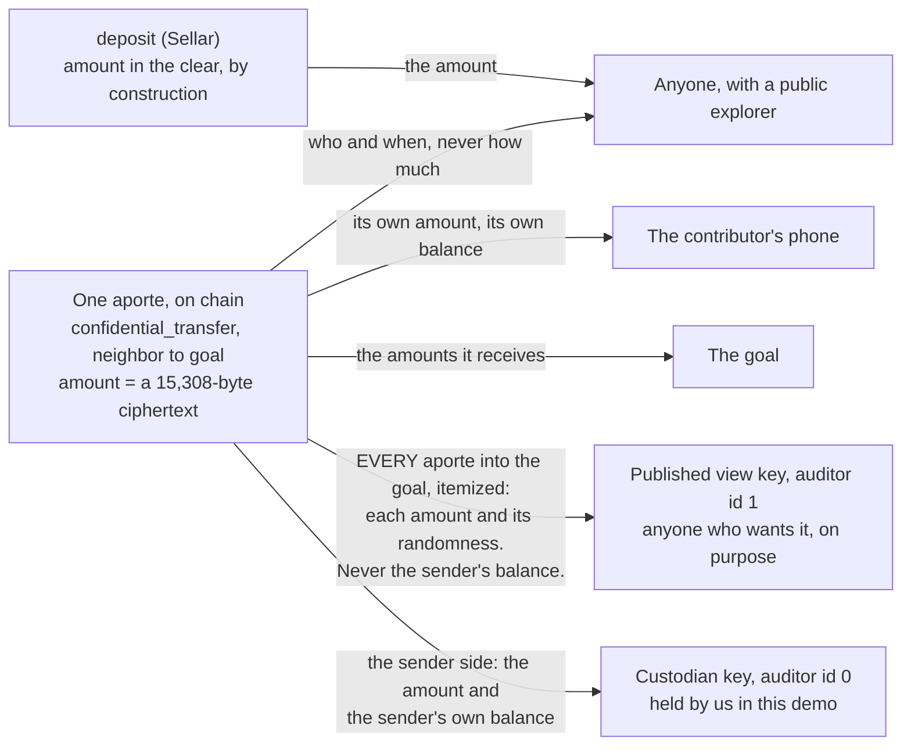
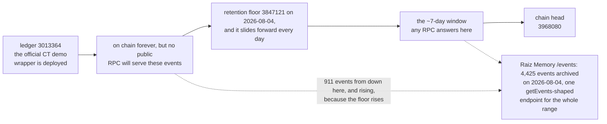
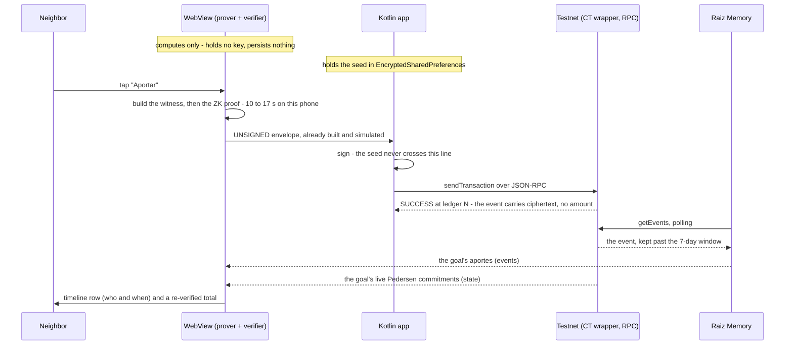
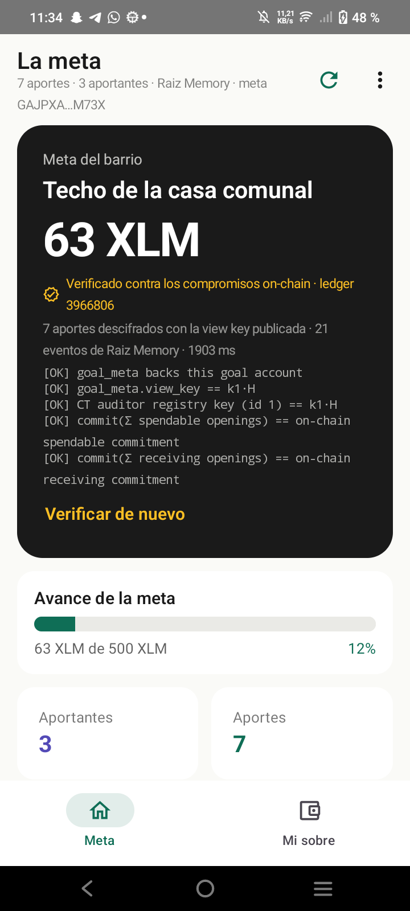
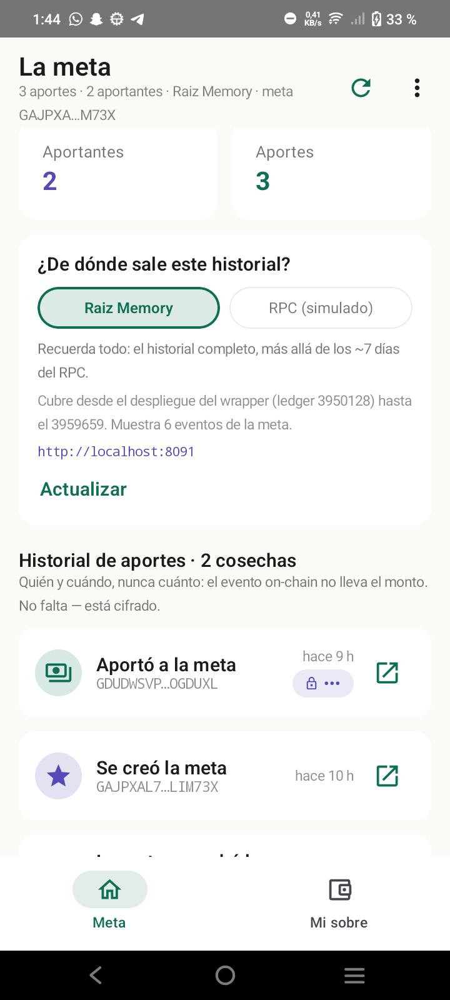
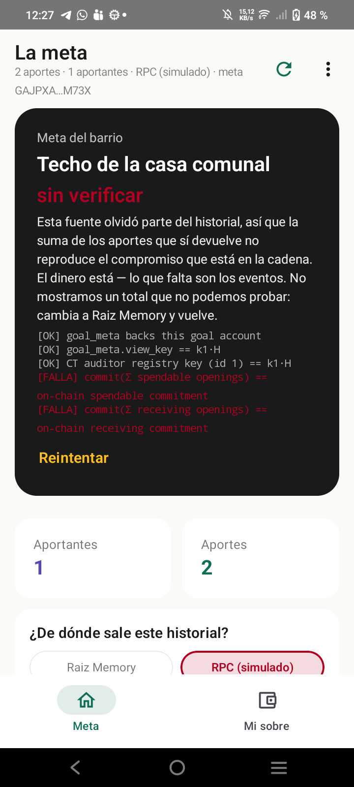
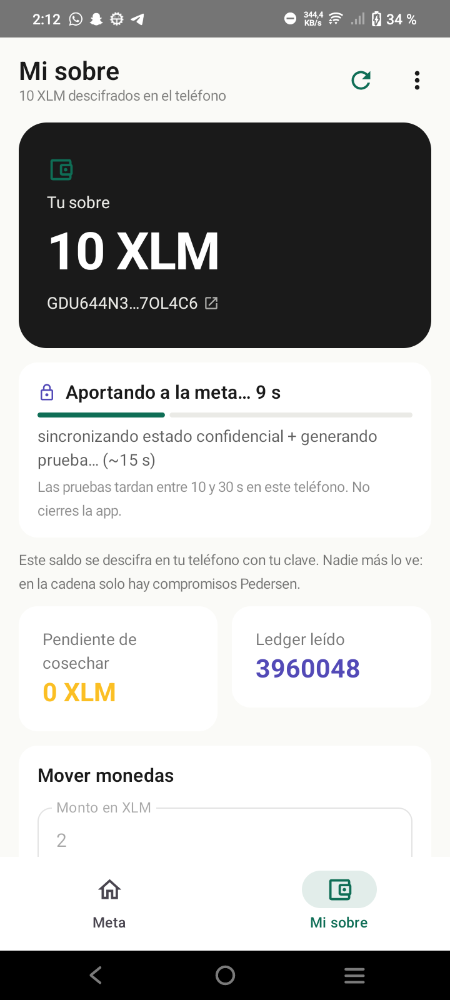
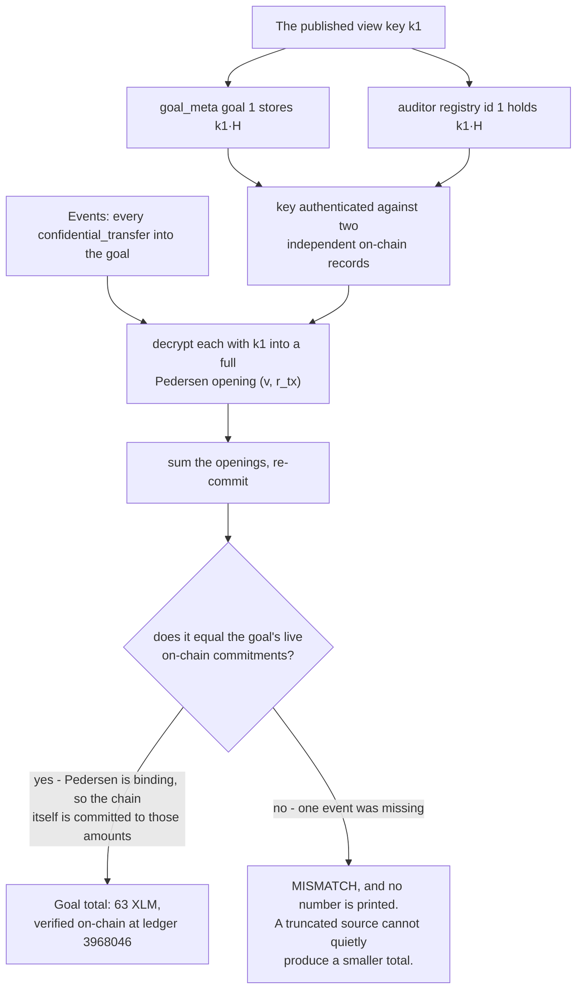

# Sobre del Barrio × Raiz Memory
### A mobile Confidential Tokens wallet — and the durable event index that keeps its history alive

> *Contributions are sealed on-chain. The fund is made of glass, on purpose. And the wallet remembers.*

**Stellar Summit SP 2026 · Special Bounty: Confidential-Token & Private-Payment Wallets · Team: Raiz Protocol**

Everything below was executed against **Stellar testnet on 2026-08-03 and 2026-08-04**. Every contract id, tx hash, timing and screenshot is real and clickable; nothing here is a mockup. Chain-dependent counts say when they were measured, because they move.

---

## 1. What this is

In Latin American neighborhoods everyone sees *who* contributes to a common cause — that's solidarity. How *much* each person gives is nobody's business — that's dignity. **Sobre del Barrio** ("the neighborhood envelope") encodes that norm with OpenZeppelin's **Confidential Tokens**: an Android wallet where neighbors contribute to community goals with the amount encrypted inside the transaction, participation public, and the goal's **auditor view key published on purpose** so anyone can verify the fund without asking us for anything.



*Stated precisely: a contribution's amount appears **nowhere** in the transaction — not as a field, not as a range — and the published key opens the fund **itemized**, which is what "glass" means here. Every arrow above is claimed with its on-chain evidence in [§8](#8-limitations-read-this-part), including the uncomfortable one — the custodian key.*

A privacy wallet reconstructs its state by replaying contract events — and Soroban RPC nodes forget them after about 7 days. So this submission ships its own memory: **Raiz Memory**, a durable `getEvents`-shaped index that any wallet adopts by changing one URL.

## 2. Two of the bounty's example builds, as one system

**(a) A CT wallet with private balances and private send** — the full cycle runs on a real mid-range phone, keys never leaving it ([§4](#4-proof-that-it-works-end-to-end)).

**(c) A durable event indexer past the RPC window** — because the primitive's own authors say so. Nethermind's private-payments README, under *Limitations*:

> "**Stellar Events retention**: The app relies heavily on Stellar events. But RPC nodes only store events for a small retention window (7 days). This means that the demo will not work for users onboarded after 7 days of contract deployment because they couldn't re-play events history."
>
> — [NethermindEth/stellar-private-payments](https://github.com/NethermindEth/stellar-private-payments), `README.md` L121 (vendored @ `a1bf177`)

Not hypothetical. The **official** CT demo wrapper was deployed at ledger `3013364`; ask the public RPC for its history (`getEvents`, `startLedger: 3013364`) and you get — captured 2026-08-04, and the range slides forward every day:

```json
{"jsonrpc":"2.0","id":1,"error":{"code":-32600,
 "message":"startLedger must be within the ledger range: 3847121 - 3968080"}}
```

The reference implementation of Confidential Tokens has already lost its own early history.

**How Raiz Memory differs from Nethermind's `tools/bootnode`.** Their bootnode is a deployment-scoped archive proxy for *their* wallet: it caches `getEvents` pages for one SPP deployment and, once a request is back inside the retention window, hands the client to its main RPC with a JSON-RPC `-32002` error. A sync-gap patch, and a good one. Raiz Memory is a **general durable index**: any contract id, no handoff, one `getEvents`-shaped endpoint answering for the whole life of a contract, plus `/coverage` stating honestly what it holds.

Its configured set is four testnet contracts at once: our CT wrapper, our `goal_meta`, the official CT demo wrapper, and `CCUUDM43…MCGZ` — the **EURC token SAC** that Nethermind's SPP EURC pool settles through (`tokenContractId` in [`deployments/testnet/deployments.json`](https://github.com/NethermindEth/stellar-private-payments), vendored). To be exact: their *pool* contracts are deployed and still emit zero events, so there is nothing to index there yet; the SAC is the busy contract next to them, and adding it was one line of `CONTRACT_IDS`. Measured on 2026-08-04: **4,425 events archived**, of which **911 sit below the RPC's retention floor** (ledger `3847121` at that moment) — 36 from the official CT demo wrapper, 875 from the EURC SAC. No public RPC can return those 911 any more. The count grows every hour, because the floor does.



*The history is permanent; the queryable window is not. Everything left of the floor is unreachable through `getEvents` — and the floor moves right every day, so the set only ever grows.*

## 3. Deployed reality (Stellar testnet)

| What | Contract id | Code | Deployed by |
|---|---|---|---|
| `goal_meta` — goal registry | `CBNVY2AAHA4SP3MX4XKJAZGS63SF4GIFNHUAAQPRSKYAXY3XR6HKIQAZ` | **ours** (`/contracts/goal-meta`) | us |
| CT wrapper over XLM | `CBWSANZN7YIMA4CWLNSAZO3HSD5NZDC2GZQJ434MOPQR7RDNVYQSDHAT` | OpenZeppelin, unmodified | **us** (ledger 3950128) |
| UltraHonk verifier | `CBFCYFND44SNQPKMQNHB3KX2C7K4U5WSVUMFJY34OV46YAN2SACM3UIA` | OZ/Nethermind, unmodified | **us** |
| Auditor registry | `CBUSX5B56KB73FAAIIHW7ISSZEGHDKQTOWML74LBPOWWGCEFEZPLHE25` | OpenZeppelin, unmodified | **us** |
| Underlying XLM SAC | `CDLZFC3SYJYDZT7K67VZ75HPJVIEUVNIXF47ZG2FB2RMQQVU2HHGCYSC` | Stellar | — |

We deployed **our own instance** of the OZ stack for one reason: on the official deployment the auditor registry is admin-gated, and registering a view key fails with a verified `Error(Contract, #2000)` = `AccessControlError::Unauthorized` — the published-view-key pattern is impossible there. As admin of our own instance we mint two auditor ids: `0` = custodian (private, used by contributors), `1` = **the goal's published view key**. Full reasoning in [`scripts/ct-flow.md` §1](scripts/ct-flow.md).

**The goal.** `goal_meta` **goal id 1** — *"Techo de la casa comunal"*, display target 500 XLM, created in tx [`e27b9f1d…`](https://stellar.expert/explorer/testnet/tx/e27b9f1dba855c37ef728d3e6a43d90ca695b15191dbf7076ce1da82c5e71699) (ledger 3952518). **Goal id 0 is a dead placeholder** from an earlier run, created before the real Grumpkin point existed — ignore it.

- Goal CT account: `GAJPXAL725N44NMEZ3XIN66ZJ7XURJNLXIDGIOOR7D3E23DIRGLIM73X` (registered under auditor id 1)
- **Published view key `k1`:** `0x0066c14835195705220b7be6f1146aec9cecfb6ecb2b6667bd1d234234afdb16`

`goal_meta` holds the goal's story, its account, its published view key and its harvest timeline. Its design invariant, enforced by there being no such parameter anywhere in the ABI: **an amount never touches this contract** ([`src/lib.rs`](contracts/goal-meta/src/lib.rs)).

## 4. Proof that it works end to end

### On-device milestone — 4/4 real transactions from a phone



*One contribution, from the tap to the total moving. The split is the design decision: the prover computes and persists nothing, the app holds the only secret and signs.*

Vivo Y21 (Android 13, 4 GB RAM, 8 cores), 2026-08-03. All four `SUCCESS`, against our own wrapper:

| Op (UX name) | Tx | Ledger | Wall clock | ZK proof |
|---|---|---|---|---|
| `register` ("Abrir mi sobre") | [`e7f9309a…`](https://stellar.expert/explorer/testnet/tx/e7f9309a679fcd1e56472bd30b76c08fc5872fe59cbebb09965ca2ba42c64ec3) | 3953009 | 27.5 s | 9.2 s |
| `deposit` 10 XLM ("Sellar") | [`2ff5108e…`](https://stellar.expert/explorer/testnet/tx/2ff5108e734a2749db27de100a3586912ca84ab353dc578ed5b107e6e73f6f43) | 3953056 | 11.3 s | none¹ |
| `merge` ("Cosechar") | [`0dcbefb4…`](https://stellar.expert/explorer/testnet/tx/0dcbefb42953d1dbfd7db620d6b33122824c66a5b33973d61d5432d97aa78038) | 3953068 | 7.2 s | none¹ |
| `confidential_transfer` 5 XLM → goal ("Aportar") | [`7f9c6f9a…`](https://stellar.expert/explorer/testnet/tx/7f9c6f9ade687a5e222a9e5f72a104820244fb33f85f6cb3458b704446307c66) | 3953087 | 28.6 s | 17.0 s |

¹ `deposit` and `merge` carry no ZK proof in the CT preview — read from the contract source, not assumed. The phone then decrypted its own balance locally to exactly **50,000,000 stroops** spendable (10 deposited − 5 contributed). Signing is byte-surgery on the envelope, validated byte-exact against `@stellar/stellar-sdk` 14.6.1 through a generated fixture and JVM unit tests. The same cycle also exists as a headless CLI run with its own real tx hashes and a chain-verified balance decryption ([`scripts/ct-flow.md` §4](scripts/ct-flow.md)).

### What the explorer can and cannot see

`node scripts/ct-flow/visibility.mjs` decodes the real envelopes:

- **`deposit`** — the amount is **public**: `arg[2] = i128(1000000000)` in the invocation, plus the underlying SAC transfer event. Crossing from public XLM into a confidential balance is a public act by construction. That is *sealing an envelope*, not *giving*.
- **`confidential_transfer`** — the amount exists **nowhere**. `arg[2]` is a 15,308-byte payload whose field *names* an explorer can pretty-print (`c_spend_new`, `c_tx`, `r_e`, `sigma`, `proof`, …) and whose every value is a field element, a Grumpkin point, or the 14,592-byte proof. The emitted event repeats the same ciphertext. There is no amount field to show.

### On-device proving: the Android WebView finding

| Environment | register | transfer | withdraw |
|---|---|---|---|
| Node on PC, 22 threads | 1.4 s | 1.8 s | 1.7 s |
| Chrome on device, 8 threads (`crossOriginIsolated`) | 2.7 s warm / 6.4 s cold | 5.4–6.7 s | 4.6–6.1 s |
| Chrome on device, 1 thread | 8.6 s | 15.7 s | 15.6 s |
| **Android WebView (always 1 thread)** | **10.8 s** | **15.7 s** | **14.2 s** |

**Android WebView never becomes `crossOriginIsolated`.** Same device, same URL (`http://localhost:4173` over `adb reverse` — secure context, `COOP: same-origin` + `COEP: credentialless` on every response): Chrome 150 reports `crossOriginIsolated: true · SharedArrayBuffer: true · threads: 8`; the WebView reports `false · false · 1`. The CT demo docs' cross-origin-isolation recipe cannot work inside a WebView at any header configuration — **WebView-embedded CT dApps prove single-threaded, by platform**. bb.js degrades gracefully, so it is a 2.6× tax rather than a blocker, which is why the day-0 decision was a full **GO** ([`docs/SPIKE_DIA0.md`](docs/SPIKE_DIA0.md)), with a UX budget of ~10–17 s per proof.

Related: the demo SDK's `CircuitProver` calls `UltraHonkBackend(bytecode)` with no options and bb.js 0.87 defaults to `{threads: 1}`, so the official demo proves single-threaded *even when* isolation succeeds. Our shim passes threads explicitly. Both findings: [`friction-report.md`](friction-report.md).

### What that looks like on the phone

Real screenshots, same device. The UI is in Spanish because the users are — *Abrir mi sobre* = `register`, *Sellar* = `deposit`, *Aportar* = `confidential_transfer`, *Cosechar* = `merge`.

| | |
|:--:|:--:|
|  |  |
| **Meta.** 63 XLM, verified *inside the wallet* at ledger 3966806: the view key checked against `goal_meta` and against the CT auditor registry, then both Pedersen commitments re-derived from the decrypted openings. Five `[OK]`s, printed where other wallets print a number and ask for trust. | **The timeline, and where it comes from.** Who and when, never how much — the lock-and-ellipsis pill sits exactly where the amount would go, because the on-chain event does not carry one. The source switch (Raiz Memory ↔ a forgetful RPC) is a live control, not a slide. |
|  |  |
| **A source that forgot.** Point the app at the forgetful RPC and the two commitment checks fail, so the wallet refuses to show a total: *"the money is there — what is missing are the events."* Refusing to print an unprovable number is the feature. | **Honest proof progress.** A confidential contribution takes ~10–17 s of single-threaded proving on this phone, so the UI says so, counts the seconds, and names the stage instead of showing a spinner and hoping. |

## 5. Don't trust our UI

### Verify the goal total yourself

Reconstructs and **verifies** the fund from the public RPC and the published key alone — it never talks to our app or any server we run. The check itself takes **~2 s** (timed); what costs time is the one-time vendor setup below, whose long pole is `pnpm install` of the demo's toolchain — network-bound, hundreds of MB, minutes on a cold cache; the `build:sdk` that follows takes ~4 s ([`scripts/verify-goal-total/README.md`](scripts/verify-goal-total/README.md)):

```sh
git clone https://github.com/brozorec/stellar-confidential-token-demo vendor/stellar-confidential-token-demo
git -C vendor/stellar-confidential-token-demo checkout ac67499
cd vendor/stellar-confidential-token-demo
npx -y pnpm@10.33.0 install && npx -y pnpm@10.33.0 build:sdk
cd ../..
node scripts/verify-goal-total/verify-goal-total.mjs
```

Real output, run on 2026-08-04 (abridged in the middle — seven contributions, `25+25+5+2+2+2+2 = 63`, held on-chain as 50 XLM already merged into spendable plus 13 XLM still pending in the receiving channel):

```
[1] cross-checking the published secret against on-chain state
  goal_meta[1] "Techo de la casa comunal" (target 500 XLM)
    stored view-key point == k1·H                      OK
  goal registered under auditor_id 1; registry key == k1·H   OK

[2] replaying confidential events from ledger 3950128
  + ledger 3950172  aporte   from GDUTRP…DJ2I  25 XLM (decrypted via k1)  tx 58363138…
  · ledger 3950173  merge (cosecha): pending folded into spendable
  + ledger 3950262  aporte   from GDUTRP…DJ2I  25 XLM (decrypted via k1)  tx d302c02f…
  · ledger 3950263  merge (cosecha): pending folded into spendable
  + ledger 3953087  aporte   from GDUDWS…DUXL   5 XLM (decrypted via k1)  tx 7f9c6f9a…
  + ledger 3960072  aporte   from GDU644…L4C6   2 XLM (decrypted via k1)  tx 323dd7ce…
  … three more 2 XLM contributions from GDU644…L4C6 …

[3] re-committing decrypted openings against on-chain Pedersen commitments
  commit(500000000, Σr_tx) == on-chain spendable commitment   OK
  commit(130000000, Σr_tx) == on-chain receiving commitment   OK

Goal total: 63 XLM — verified on-chain at ledger 3968046
```



*Decryption alone would prove nothing — a script can print any number. Drop one contribution and the re-commitment misses, loudly: a truncated event source cannot quietly yield a smaller total, which is exactly why the index matters.*

**What Raiz Memory does and does not rescue here.** This check needs two different things: the **events** (the contributions, which the RPC drops after ~7 days) and **chain state** (the goal's live commitments, the auditor-registry key, `goal_meta`'s stored point — which any RPC still serves, because state is not events). Raiz Memory makes the first durable; it is *not* an RPC and never pretends to be — it answers exactly three GET routes, `/health`, `/coverage` and `/events` ([`raiz-memory/src/main.rs:90-92`](raiz-memory/src/main.rs)), so pointing `--rpc` at it would 404 on the state reads. The app already splits the two: the in-wallet verification takes its events from a configurable source (Raiz Memory or the RPC) and its state from an RPC — see `eventsUrl` vs `rpcUrl` in [`raiz-shim.js`](wallet/app/src/main/assets/prover/raiz-shim.js). This CLI script is the single-source version and inherits the RPC's window: past it, `[2]` finds no contributions and says so instead of printing a number. Giving it the same split is a small, deliberate post-video change (`BACKLOG.md`).

### Verify a contributor's receipt

Selective disclosure with the preview's real `disclose_sender` circuit — a proof that *I sent this on-chain transfer, for this amount*, sealed to one recipient's key ([`scripts/receipt/README.md`](scripts/receipt/README.md)):

```sh
node scripts/receipt/make-receipt.mjs    # verifier mints (P_R, ν); Marta proves → receipt.json
node scripts/receipt/verify-receipt.mjs  # the §5.3 verification, chain-anchored
```

```
  ✔ VK pinned: disclose_sender artifact matches the shared 1760B verification key
  ✔ Resolved ref_E on-chain: transfer GDUTRP… → GAJPXA… in tx 5836313815… (ledger 3950172)
  ✔ Read PVK_A / PVK_B from the on-chain accounts
  ✔ UltraHonk proof verified against the reconstructed public inputs
  ✔ Decrypted ṽ_disc with r_R and ν → amount 250000000

VERIFIED: the on-chain transfer in tx 58363138… (ledger 3950172)
  was SENT by GDUTRPFZAL3QRHCY47A6KAI6EK4XJTZ35J5IWI7YN3VGHHWA5F77DJ2I
  for exactly 25 XLM (250000000 stroops)
```

Flip one byte of the proof and it is `REJECTED at §5.3 stage [verify-proof]`. The verifier trusts only the chain: every public input is re-read from the ledger, and the receipt contributes just the proof plus a ciphertext sealed to the verifier's key — a leaked receipt file reveals nothing to anyone else.

## 6. Quickstart per component

```
/wallet        Android app (Kotlin) — headless WebView prover + native signing
/contracts
  /goal-meta   goal_meta (Soroban, Rust) — goal registry; amounts never touch it
/raiz-memory   Rust indexer — getEvents-shaped API beyond the 7-day window
/scripts       ct-flow (deploy + full CT cycle) · verify-goal-total · receipt · prover-bench
/vendor        (gitignored) read-only clones of external repos
```

> **Fresh-clone prerequisite.** `/vendor` is gitignored, and everything except `raiz-memory` and `goal_meta` needs it: the vendor clone + `build:sdk` shown in [§5](#5-dont-trust-our-ui) is step zero for `scripts/*` **and** for the wallet's prover assets.

**Raiz Memory** (Rust + SQLite, no external services — the only component with no prerequisites at all):

```bash
cd raiz-memory
cp .env.example .env               # RPC_URL + CONTRACT_IDS; the defaults are our four contracts
RUST_LOG=info cargo run            # or: docker compose up — without RUST_LOG the backfill/clamp lines are invisible
curl localhost:8090/health         # {"status":"ok","latest_indexed_ledger":N}
curl localhost:8090/coverage       # per contract: what we hold, and what the RPC had already lost
curl "localhost:8090/events?contractId=CBWSANZN…&startLedger=3950128"
cargo test                         # 15 tests, offline (RPC mocked, throwaway SQLite)
```

A first run backfills: each contract starts at `BACKFILL_FROM_LEDGER` / `CONTRACT_START_LEDGERS`, not at the chain head. Asking for history the RPC has already dropped is clamped, not fatal — on a clean database today the CT demo wrapper logs `backfill CLAMPED … 833747 ledgers of history were already gone before this index existed`, and `/coverage` keeps saying so forever.

Purge demo: start with `RETENTION_SIMULATION_LEDGERS=120`, then compare `…/events?contractId=…&source=rpc-simulation` (an RPC that forgets, complete with an `oldestLedger` floor) against the same URL without the parameter (Raiz Memory that remembers). Only requests carrying that parameter are affected.

**goal_meta**:

```bash
cd contracts/goal-meta
cargo test                        # 13 tests
stellar contract build
bash ../../scripts/goal-flow.sh   # create_goal → get_goal → record_harvest → verify via getEvents
```

`goal-flow.sh` reads a gitignored `.env.deploy` at the repo root and refuses to start without `GOAL_META_CONTRACT_ID`, `GOAL_META_DEPLOYER_SECRET` and `GOAL_META_DEPLOYER_PUBLIC` (optional: `GOAL_ACCOUNT`, `VIEW_KEY_HEX`). `verify-goal-total` needs no secrets and no proving backend; `receipt` and `ct-flow` read `.env.deploy` too.

**Wallet**:

```powershell
node wallet/tools/build-prover-assets.mjs   # packs bb.js/wasm/circuits from /vendor (~16.4 MB, gitignored)
cd wallet
"sdk.dir=C\:\\Users\\you\\AppData\\Local\\Android\\Sdk" > local.properties  # or set ANDROID_HOME; it is gitignored
$env:JAVA_HOME = 'C:\Program Files\Android\Android Studio\jbr'   # a JDK 17-21; PATH Java 25 cannot run Gradle 8.10.2
.\gradlew.bat :app:assembleDebug            # macOS/Linux: JAVA_HOME=... ./gradlew :app:assembleDebug
```

Install and launch. Three screens, in the RAÍZ visual language ([§7](#7-reused-vs-original)): **Meta** — the goal's total, *verified inside the wallet* against the on-chain commitments (the same five checks the CLI script runs), a contribution timeline of who and when, and a live switch between event sources; **Mi Sobre** — the locally decrypted balance and the four CT operations with honest proof progress; **Cosechar** — folding pending contributions into spendable. The event-source URL is editable in Ajustes, which is what makes the purge scene a demo instead of a slide.

## 7. Reused vs. original

**Reused, unmodified, with credit** — imported or served as-is; no vendor file was edited:

| Source | Pin | Used for |
|---|---|---|
| [OpenZeppelin/stellar-contracts](https://github.com/OpenZeppelin/stellar-contracts) (branch `feat/confidential-verifier-ultrahonk`) | `9b5ed96` | CT wrapper, auditor registry, Noir circuits; deployed from vendor-built WASM + verification keys |
| [brozorec/stellar-confidential-token-demo](https://github.com/brozorec/stellar-confidential-token-demo) | `ac67499` | proving stack (`@aztec/bb.js` 0.87.0, `@noir-lang/noir_js` 1.0.0-beta.9), SDK witness builders, auditor decryption, `disclose_sender` disclosure artifacts |
| [NethermindEth/stellar-private-payments](https://github.com/NethermindEth/stellar-private-payments) | `a1bf177` | read-only reference; the retention quote above, and the deployment file that names the EURC SAC Raiz Memory indexes |

**Declared prior team work — RAÍZ, and exactly what we took from it.** RAÍZ is our pre-existing Android app (Kotlin, Compose, passkeys via the OZ Smart Account Kit) and its Soroban contracts. It is why we could target mobile at all. Concretely, **11 files of its design system were adopted into this app** (~1,000 lines including headers), each carrying a header naming its RAÍZ source and any edit — the audit trail is [`docs/raiz-reuse-plan.md`](docs/raiz-reuse-plan.md), written before a line was copied:

- verbatim but for the `package` line: `ui/theme/Color.kt` · `ui/theme/Type.kt` · `ui/theme/Theme.kt` (one identifier renamed) · `ui/util/StellarExpert.kt` · `ui/components/StatBox.kt`
- copied with a named edit: `ui/components/SobreCard.kt` (RAÍZ `BalanceCard`) · `GoalProgressBar.kt` (`UsageBar`) · `AporteRow.kt` (`ExecutionRow` — **with the amount `Text` deleted**, which is the whole product) · `VerifyRow.kt` (`ContratoFila`) · `PhaseBanner.kt` (`AccountSetupBanner`) · `StepFeedback.kt` (`ActionFeedback`)

Nothing else came from RAÍZ. Its Stellar stack (Soneso SDK, Hilt, navigation-compose) was deliberately *not* adopted — `raiz-reuse-plan.md §"Do NOT copy"` — so the CT layer, custody, signing, RPC and indexer code below are ours, written here. Folding this CT layer back into RAÍZ is post-summit work.

**Original, built for this bounty:**

- `goal_meta` Soroban contract (13 tests, explicit TTL policy checked against the live testnet archival config)
- **Raiz Memory** — the indexer, its `getEvents`-shaped API, `/coverage`, the clamped backfill, and the purge-demo mode (15 tests)
- the Android CT layer: headless-WebView `ProverWebViewBridge` + APK-packaged proving assets, the JS shim (including the in-wallet verification), and native Kotlin key custody / Ed25519 signing / RPC submission
- the three screens, their view models, the SCVal decoder and the event-source layer — the RAÍZ files above are components those screens are built *from*, not the screens
- the **published-view-key pattern** (auditor id 1 as the goal's public auditor) and the deployment model it implies
- `scripts/`: `ct-flow` (own-instance deploy, full cycle, view-key audit, envelope visibility), `verify-goal-total`, `receipt`, `prover-bench`, `goal-flow.sh`
- [`friction-report.md`](friction-report.md) and the issue drafts in [`docs/issues-drafts/`](docs/issues-drafts/), five of them now filed upstream ([§9](#9-friction-filed-back))

## 8. Limitations (read this part)

- **Confidential Tokens are a developer preview: testnet only, unaudited.** So is SPP. No real money anywhere in this repo.
- **The published view key opens each contribution, not just the total.** `k1` opens the *recipient channel* of every transfer into the goal, yielding each contribution's amount and its randomness — anyone holding it audits the fund contribution by contribution. What `k1` does **not** open is the sender channel (demonstrated on-chain: `auditTransfer(k1).channelsAgree === false`), so contributor balances are unreadable with it. Read the promise as: *your contribution is invisible to the chain and to bystanders, and legible to the neighborhood's published key; your balance is not in it.*
- **Contributors have an auditor too, and in this demo it is us.** CT requires every account to commit to an `auditor_id` at `register()`; contributors use id 0, the custodian key, which *does* open the sender channel (verified: amount + the sender's post-transfer balance). That key is private and stays private, but "private from us" is not a claim this deployment can make. It is a property of the preview's compliance design; a real community deployment must decide who holds id 0.
- **`deposit` is public** ([§4](#what-the-explorer-can-and-cannot-see)) — moving XLM into a confidential balance reveals that amount. Only the contribution itself is confidential.
- **Identities are visible by design.** That is CT's model, and here it is the feature. If you need counterparties hidden too, that is SPP's territory — which Raiz Memory indexes the same way, one line of config. Stated precisely: today it indexes the EURC SAC that their pool settles through, because their pool contracts have emitted no events yet.
- **No per-account view keys exist in the preview**: the unit is a contract-level `auditor_id`, admin-gated to mint (verified `Error #2000` on the official deployment). Our pattern therefore implies a deployment model — one CT wrapper per community, goal accounts under the published id.
- **Proving is single-threaded in a WebView** (~10–17 s per proof on a 4 GB phone); the Chrome/PWA path is 2.6× faster and stays documented as the alternative.
- **Raiz Memory backfills, but it cannot un-forget.** A first run reaches back to the ledger you configure — yet if the RPC has already dropped that range, the index starts at the RPC's floor and records permanently how much was unreachable (today, for the CT demo wrapper: `833747` ledgers). So an instance still has to exist *before* the window closes to hold the earliest history; what it holds after that, it holds forever. Honest wrinkle in our own deployment: the long-running instance we demo from predates the feature, so its contracts were already tailing and its `/coverage` carries no `backfill` object — a fresh instance's does, clamp note included.
- **Receipts depend on event resolution**: the vendor verifier reads the event from an RPC, so a receipt older than the retention window stops verifying against a bare RPC. Wiring Raiz Memory in as that source is the obvious next step (`BACKLOG.md`, not done).
- Goal custody in this demo is the team's key; production custody belongs in a communal smart account — roadmap, not faked here. And `goal_meta` goal id 0 is a dead placeholder: the real goal is id 1.
- Worth flagging to any native Stellar mobile wallet: `*.stellar.org` chains to the Sectigo R46 root, **absent from many Android system trust stores**, so native HTTPS fails with `Trust anchor for certification path not found` while Chromium (which AIA-chases) works. Fixed here with an additive `networkSecurityConfig` — no pinning, no trust bypass.

## 9. Friction, filed back

[`friction-report.md`](friction-report.md) logs every friction we hit with the CT/SPP previews and the surrounding tooling, with **verbatim** error messages, versions and repro steps — 15 entries covering the admin-gated auditor registry, the silently single-threaded prover, the WebView isolation gap, an RPC filter that rejects a whole call because of one bad id, a `--optimize=false` flag the current CLI no longer accepts, an `InsufficientRefundableFee` on a first TTL-bumping submission, a retention floor that moves *while you use it*, and the Android trust-anchor issue above.

Ten were written up as issue drafts in [`docs/issues-drafts/`](docs/issues-drafts/). Before filing any of them we re-verified every claim against current tooling — and **five did not survive**, which is the part worth reading. Our `stellar` CLI was 23.2.1 while the current release is 27.1.0, four majors newer and above the CT demo's own documented prerequisite of ≥ 25.2. Three drafts existed only because of that stale binary; one of them, `--optimize=false`, would have reported our failure to meet a documented prerequisite as somebody else's bug. A fourth blamed OpenZeppelin for an access-control gate that lives in the demo's contract, not theirs. Each dropped draft keeps its disproof in the file.

The five that held up are filed:

| Issue | What it reports |
|---|---|
| [stellar-rpc#918](https://github.com/stellar/stellar-rpc/issues/918) | `simulateTransaction` under-sizes the refundable fee on TTL-extending calls — 4 of 8 consecutive runs fail, alternating |
| [stellar-rpc#919](https://github.com/stellar/stellar-rpc/issues/919) | One malformed `contractId` rejects a whole `getEvents` batch, named only by index |
| [stellar-confidential-token-demo#4](https://github.com/brozorec/stellar-confidential-token-demo/issues/4) | `CircuitProver` proves single-threaded even when isolation succeeds — a 2-3× tax, in two lines of code |
| [stellar-contracts#832](https://github.com/OpenZeppelin/stellar-contracts/issues/832) | Docs: view keys are per-deployment, not per-account, and what the recipient channel actually reveals |
| [stellar-contracts#833](https://github.com/OpenZeppelin/stellar-contracts/issues/833) | Docs: Android WebView cannot be cross-origin isolated, so embedded clients always prove single-threaded |

A preview's most useful hackathon output is a precise bug report — and the discipline that throws half of them away.

## 10. Demo & deployment

- **Repo:** <https://github.com/JuanWimmin/raiz-confidential-stack> — this is the submission.
- **Landing page:** [`web/`](web/) — one self-contained `index.html`, no build step, no dependencies.
- **Demo video (2:30):** recorded on 5–6 August 2026 from the shooting script in [`docs/demo-run.md`](docs/demo-run.md), which was already rehearsed end to end on the phone with stopwatch timings. The link goes here and into the landing page the moment it is up; if you are reading this and there is no link, it is not up yet.
- **Public Raiz Memory instance:** an ephemeral **cloudflared quick tunnel** started by [`scripts/serve-public.ps1`](scripts/serve-public.ps1) — we have no VM, and the quick tunnel regenerates its hostname on every start, so no permanent URL is promised here. The reproducible route for a judge is the container in [`docs/deploy-public.md`](docs/deploy-public.md); it needs no tunnel and no trust in us.

---
*Raiz Protocol — community savings on Stellar. The value the neighborhood creates stays in the neighborhood, and the neighborhood decides.*
